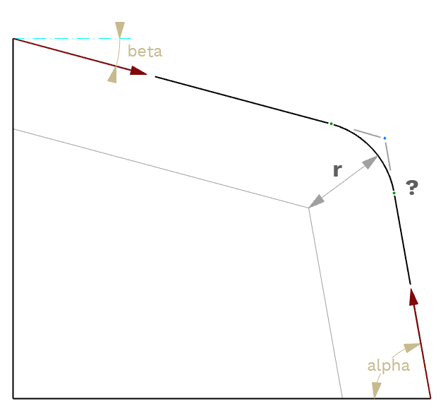

# [GDL-playground](https://github.com/runxel/GDL-playground)
Playground for my GDL objects. Acts like pile of snippets. So if you see something of interest: Go and grab it and use it in your own projects.

_Your mileage may vary._

No support!
It's just for learning, folks.

---

**Check out [my production objects](https://github.com/runxel/ArchiCAD-Objects) and find out how you can [boost your productivity](https://github.com/runxel/GDL-sublime) while programming your own GDL objects for Archicad!**

---

## [Get User Language](objects/Get-Language)

See [full article](https://lucasbecker.de/posts/detecting-user-s-language-via-gdl) on how to detect (kinda) the language the user might speak.

## [Image Filter](objects/Image-Filter)

DEMO for a image filter process. The filter (via a prefix) serves to limit the otherwise very large and performance-heavy image selection in a GDL object.

## [Rounded Prisma](objects/Rounded-Prisma)

This object is a demo for a modeling case where you have two vectors with their angles and need a rounded corner where those vectors meet. How to get the coordinates?
The solution is to offset the vectors by the radius and offset their intersection point back onto the original vectors.

Note: uses the ["BasicGeometricCalc" macro](http://gdl.graphisoft.com/tips-and-tricks/calling-basicgeometriccalc-macro), which is now deprecated. Could easily be rewritten to use the newer, dict-based ["BasicGeometry" macro](http://gdl.graphisoft.com/tips-and-tricks/using-basicgeometry-macro).

---

_Tautological boilerplate: All trademarks and copyrights on this page are the property of their respective owners._